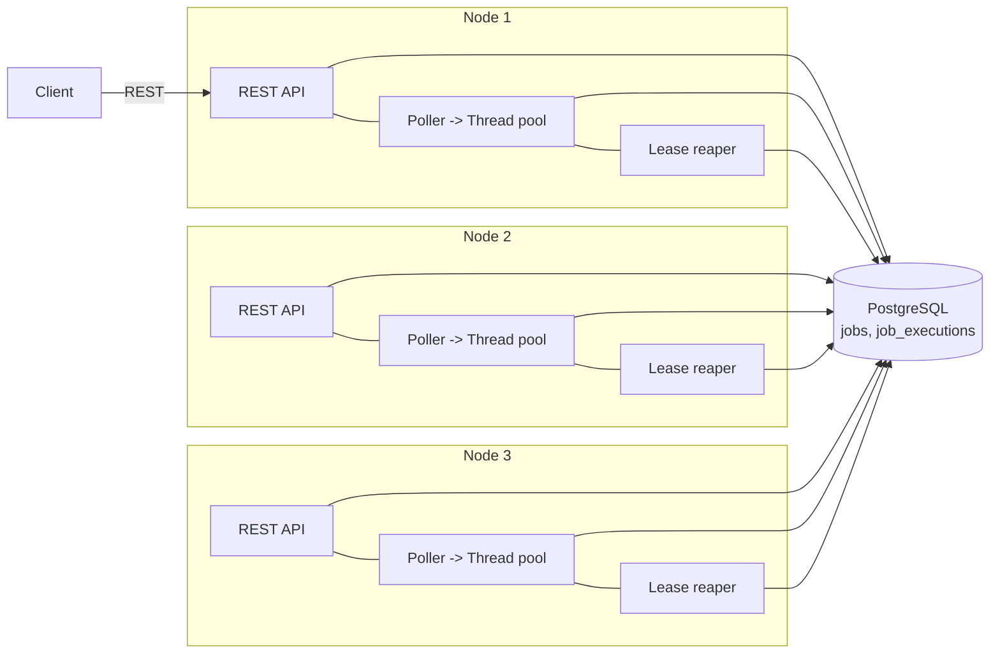
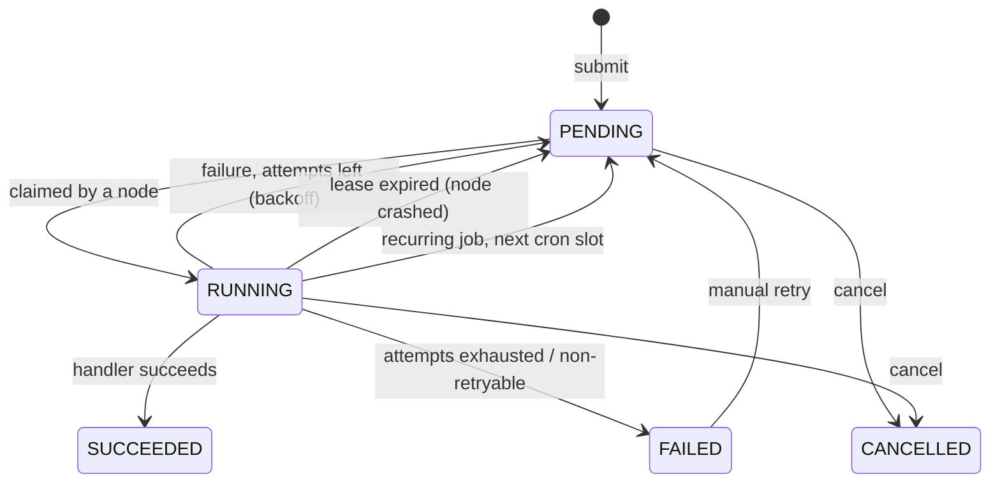

# Distributed Job Scheduler

A fault-tolerant job scheduler in **Java 21 + Spring Boot 3**, where any number of worker nodes share
one **PostgreSQL** queue with no leader and no external broker. It supports delayed, prioritized and
recurring (cron) jobs, automatic retries with exponential backoff, per-job timeouts, idempotent
submission, and recovery of work from crashed nodes.


## Architecture



### Job lifecycle



## Key design decisions

**Claiming with `FOR UPDATE SKIP LOCKED`.** Each node claims due jobs in one atomic
`UPDATE ... WHERE id IN (SELECT ... FOR UPDATE SKIP LOCKED) RETURNING *`. Concurrent pollers skip
rows that another node is claiming instead of blocking on them, so every job goes to exactly one node
and throughput scales with the number of nodes. `JobClaimConcurrencyTest` checks this with 12
concurrent pollers competing for 2,000 jobs.

**Leases instead of a leader.** A claim sets `lease_until = now + timeout + grace`. Every node runs a
reaper that returns jobs with expired leases to the queue (or fails them if out of attempts). If a node
crashes mid-job, its work is picked up by the others without any coordinator.

**Fencing tokens.** `attempts` is incremented on every claim and must match when a node records the
result (`WHERE locked_by = :node AND attempts = :attempts`). A slow node that lost its lease cannot
overwrite the result of the node that took over, and a cancelled job cannot be flipped back to
SUCCEEDED.

**Backpressure.** A semaphore sized to the worker thread pool limits claims to free execution slots. A
busy node never hoards jobs that idle nodes could run, and the in-memory queue can never grow unbounded.

**Retries with exponential backoff and jitter.** `delay = base * 2^(attempt-1)`, capped, then
randomized by +/-20% so jobs failing together (e.g. during a downstream outage) don't retry in lockstep.
Handlers can throw `NonRetryableJobException` to fail fast.

**Timeouts.** A watchdog interrupts handlers that exceed `timeoutSeconds`. The interrupt is guarded so it
can never hit a pool thread that has already moved on to another job.

**Idempotent submission.** An optional `idempotencyKey` (unique index + `ON CONFLICT DO NOTHING`)
makes client retries safe: resubmitting returns the original job with `200` instead of `201`.

**Graceful shutdown.** On SIGTERM a node stops claiming, waits for running jobs, then releases any
unfinished claims back to the queue without consuming an attempt.

**Delivery guarantee.** Execution is *at-least-once*: a job can run again if a node dies after doing the
work but before recording it. Handlers should therefore be idempotent, which is the standard trade-off
for queue-based systems.

## Tech stack

Java 21, Spring Boot 3.3 (Web, JDBC, Validation, Actuator), PostgreSQL 16, Flyway, Micrometer +
Prometheus, JUnit 5, Testcontainers, Awaitility, Docker Compose, GitHub Actions.

## Running it

Requirements: Docker. (For running tests locally: JDK 21 and Maven 3.9+.)

```bash
docker compose up --build        # PostgreSQL + 3 scheduler nodes on ports 8081-8083
```

Submit a job to any node:

```bash
curl -X POST localhost:8081/api/jobs -H 'Content-Type: application/json' \
  -d '{"type": "sleep", "payload": {"millis": 500}}'
```

Other examples:

```bash
# Flaky job: watch retries with backoff in the logs
curl -X POST localhost:8081/api/jobs -H 'Content-Type: application/json' \
  -d '{"type": "flaky", "payload": {"failureRate": 0.7}, "maxAttempts": 5}'

# Recurring job every 30 seconds (6-field Spring cron, UTC)
curl -X POST localhost:8081/api/jobs -H 'Content-Type: application/json' \
  -d '{"type": "sleep", "cron": "*/30 * * * * *", "payload": {"millis": 100}}'

# Idempotent submission: the second call returns the same job with HTTP 200
curl -X POST localhost:8081/api/jobs -H 'Content-Type: application/json' \
  -d '{"type": "sleep", "idempotencyKey": "invoice-42"}'
```

### API

| Method | Path | Description |
|---|---|---|
| POST | `/api/jobs` | Create a job (201, or 200 if the idempotency key already exists) |
| POST | `/api/jobs/batch` | Create up to 1,000 jobs |
| GET | `/api/jobs/{id}` | Job details |
| GET | `/api/jobs?status=FAILED&limit=50` | Recent jobs, optionally filtered by status |
| GET | `/api/jobs/{id}/executions` | Per-attempt history: node, timings, outcome, error |
| POST | `/api/jobs/{id}/cancel` | Cancel a pending or running job |
| POST | `/api/jobs/{id}/retry` | Re-queue a failed or cancelled job |
| GET | `/api/jobs/stats` | Job counts by status |
| GET | `/api/jobs/types` | Registered job types |
| GET | `/actuator/prometheus` | Metrics: throughput, durations, retries, timeouts, reaped jobs |

Job fields: `type` (required), `payload` (JSON), `priority` (-100..100), `runAt` (ISO-8601),
`cron`, `maxAttempts` (1..20, default 3), `timeoutSeconds` (1..3600, default 60), `idempotencyKey`.

### Adding a job type

```java
@Component
public class SendEmailJobHandler implements JobHandler {
    public String type() { return "send-email"; }

    public void execute(JobContext ctx) {
        String to = ctx.payload().path("to").asText();
        // ... must be safe to run more than once
    }
}
```

## Failure demo

```bash
python3 scripts/load_test.py --url http://localhost:8081 --jobs 5000 --work-ms 200 &
sleep 5 && docker compose kill scheduler-2
```

Node 2 dies without releasing its in-flight jobs. Their leases expire after `timeoutSeconds` plus the
30-second grace period (about 90 seconds with defaults), then the reapers on nodes 1 and 3 return them
to the queue. The load test still finishes with every job completed, and `/api/jobs/{id}/executions`
shows which node finally ran each recovered job.

## Load test

```bash
python3 scripts/load_test.py --url http://localhost:8081 --jobs 10000 --work-ms 20
```

Prints end-to-end throughput in jobs/minute. Results depend on hardware, node count and
`WORKER_THREADS`; record your own numbers here.

| Setup | Jobs | Work per job | Throughput |
|---|---|---|---|
| 3 nodes x 8 threads, laptop | 10,000 | 20 ms | _fill in_ |

## Tests

```bash
mvn verify     # needs Docker running for Testcontainers
```

- `BackoffPolicyTest`: backoff growth, cap and jitter bounds
- `JobClaimConcurrencyTest`: exactly-once claiming under 12 concurrent pollers, lease recovery, fencing
- `JobLifecycleTest`: success, retries to failure, timeouts, idempotency, cancellation, validation

## Limitations and possible extensions

- PostgreSQL is the single point of failure and the throughput ceiling. Beyond a few thousand jobs per
  second, a partitioned log (Kafka) or a sharded queue table would be the next step.
- Cron times are evaluated in UTC; a timezone per job could be added.
- A cancelled job that is already running finishes its current execution (its result is discarded by
  fencing); cooperative cancellation could interrupt it.
- Old finished jobs are kept forever; a retention job (which could itself be a scheduled job) would
  archive them.
